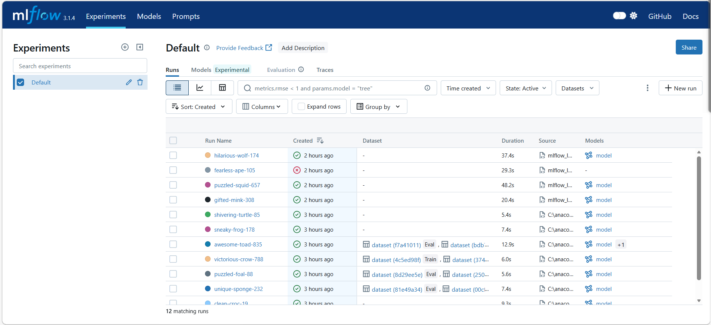
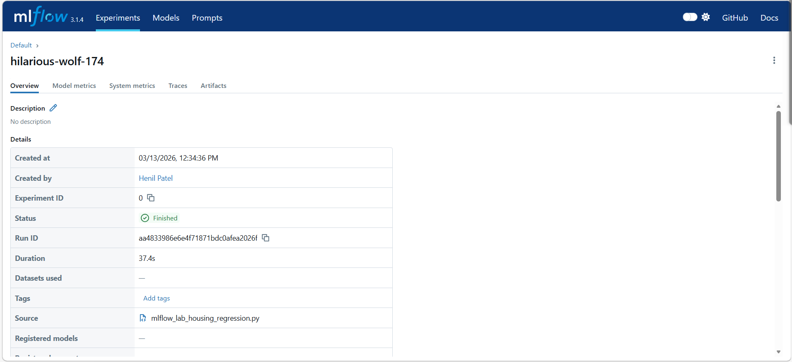
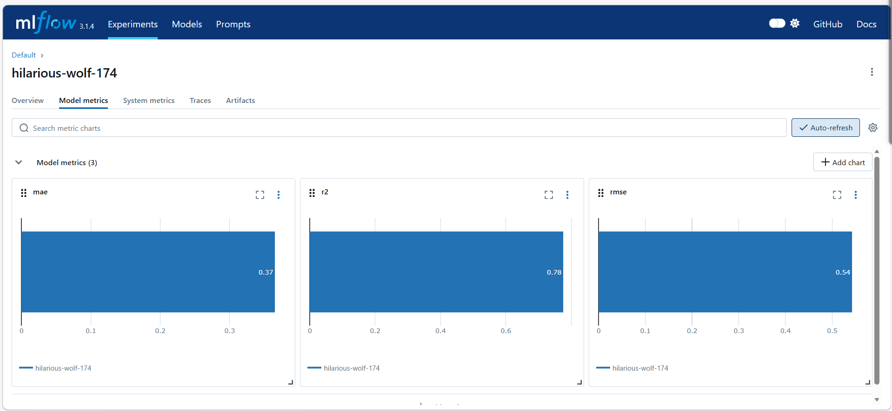
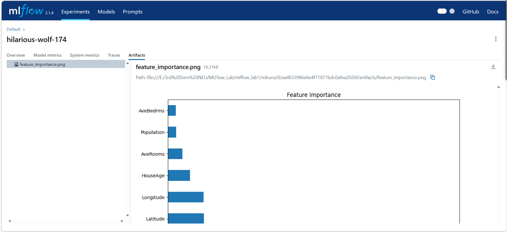
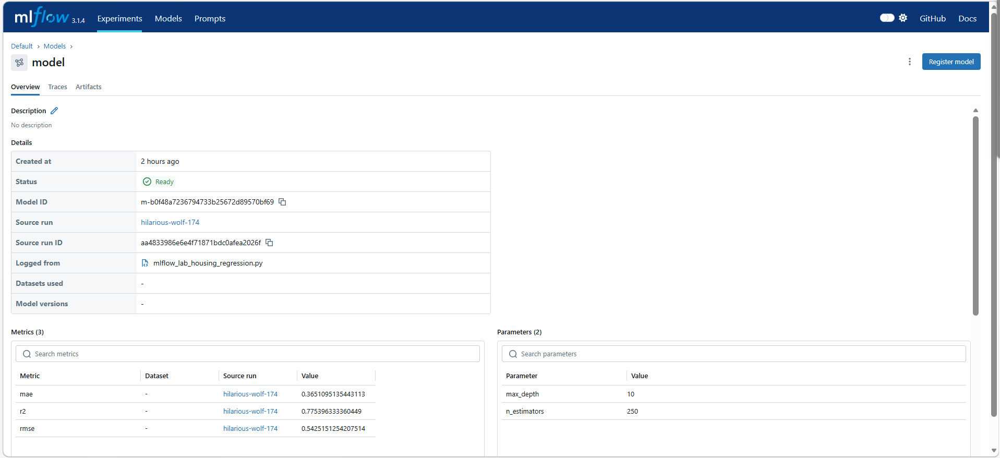
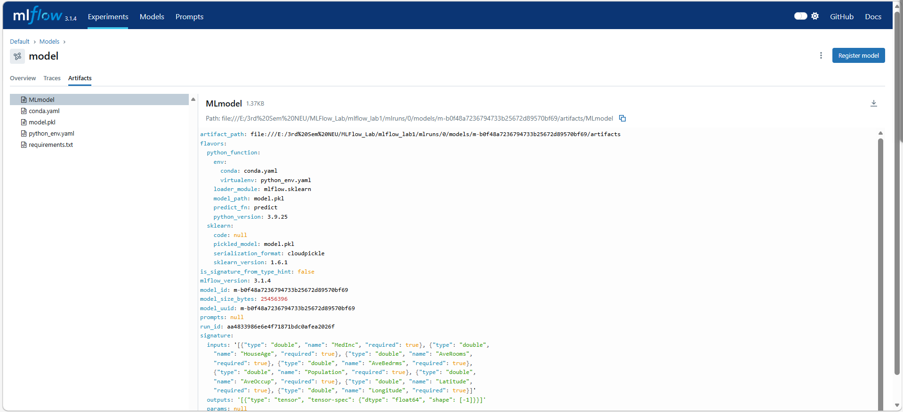
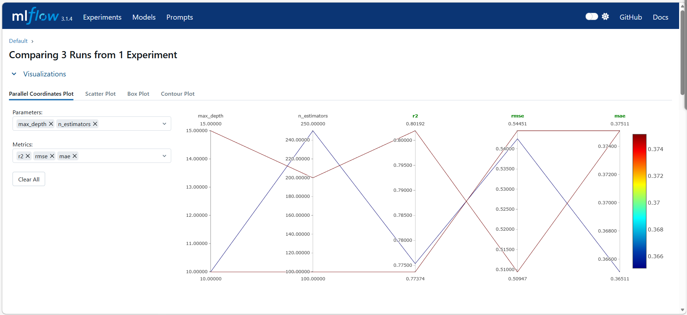
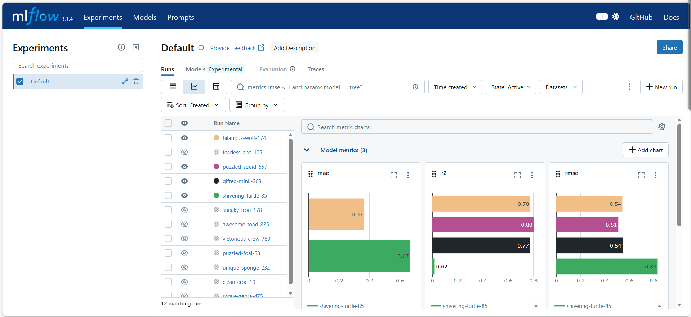

# Housing Price Prediction Regression Model Tracking with MLflow

This project demonstrates a production-grade MLOps workflow using **MLflow** to track experiments, log metrics, and manage models. It uses a **Random Forest Regressor** to predict median house values based on the California Housing dataset.

## Features
* **Experiment Tracking:** Logs hyperparameters (`n_estimators`, `max_depth`) and performance metrics.
* **Modular Evaluation:** Uses a dedicated helper function for `RMSE`, `MAE`, and `R2` calculation.
* **Artifact Logging:** Automatically generates and saves a **Feature Importance** plot for every run.
* **Model Signatures:** Defines input/output schemas to ensure model reproducibility.
* **Deployment Ready:** Includes logic to automatically register models when connected to a remote tracking server.

## Setup & Installation

### Environment Setup
To run this project you can follow these steps:

1. Create a new Conda environment or Virtual environment
```bash
conda create -n mlflow_housing python=3.9 -y
conda activate mlflow_housing
```
2. Download and install the required libraries
```bash
pip install -r requirements.txt
```

3. You can run this project by either running cells in sequential order or run python script.

    A. ipynb file

    - Run the cells in sequential order
    Note: You can change the value of parameters and you can compare the perfromance of model with different parameters using MLflow.

    - Run this command to launch MLflow UI

```bash
mlflow ui
```

- You will be able to see MLflow UI Dashboard and you can see runs of model and compare the performance of the model with the different parameters.

    B. Python script

    - Run this command in your terminal
```bash
python run mlflow_lab_housing_regression.py
```

- If you run it using this command then by default it takes value of n_estimators=100, max_depth=10.

- Run this command in your terminal to train model using different value you can use this command
```bash
python run mlflow_lab_housing_regression.py 200 15
```

- Run this command to launch MLflow UI
```bash
mlflow ui
```

4. Open your browser and navigate to: http://127.0.0.1:5000

You can see the MLflow Dashboard like below image:



You can see different metrics, compare model's perfromance and track the model as shown in below images















## How it works

When you execute the script, the mlflow.start_run() command opens a recording session. 

As the Python code calculates the math for the Random Forest, MLflow simultaneously captures the inputs and results you specify. It doesn't just save a snapshot at the end; it tracks the data in real-time. 

If the script finishes successfully MLflow marks that specific run as "Finished", the session is closed and saved; if it crashes, MLflow marks that specific run as "Failed" in the history so you know those results are wrong.

How it is saved in the code

Parameters: The mlflow.log_param() lines capture your choices, like the number of trees (n_estimators). This is saved as a simple text file inside the mlruns folder, making it very easy for the UI to read and display in a table.

Metrics: The mlflow.log_metric() lines record your scores, such as rmse and r2. Unlike parameters, these are saved with a timestamp. This allows MLflow to create those performance graphs you see in the UI, showing how the model improved or worsened as you changed settings.

Artifacts: The mlflow.log_artifact() command takes the physical .png file of your Feature Importance graph and moves a copy of it into a dedicated artifacts sub-folder. This keeps your project folder clean while ensuring the image is forever linked to that specific version of the model.

The Model: The mlflow.sklearn.log_model() command is the most complex. It doesn't just save the model; it saves a folder containing the model itself (a .pkl file), a list of the exact library versions needed to run it (conda.yaml), and the Signature (the input/output contract).

When you run MLflow on your laptop without a remote server, it creates an mlruns folder in your current directory. It uses a File-based Store.

How it is organized:

- **mlruns/:** The root directory.

- **0/:** The Experiment ID (Default is 0).

- **meta.yaml:** Contains experiment metadata (name, location).

- **<run_id>/:** A unique folder for every single time you click "Run."

- **params/:** Individual text files for every parameter logged.

- **metrics/:** Files containing timestamps and values for every metric.

- **artifacts/:** A sub-folder containing your actual files (models, plots).

- **tags/:** User-defined metadata.

Local vs. Online Storage

Locally: Everything is stored in the mlruns folder on your hard drive. MLflow creates a folder hierarchy where each Experiment has a number, and each Run has a long unique ID. Inside that ID folder, you will find separate sub-folders for params, metrics, and artifacts.

Online: Instead of small text files in a folder, MLflow uses a Relational Database (like PostgreSQL, MySQL, or SQLite) to store parameters and metrics. These files are uploaded to Cloud Storage like S3 bucket and the link is recorded to that file in the SQL database.